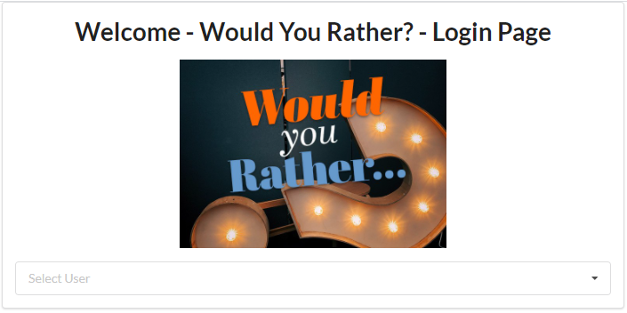
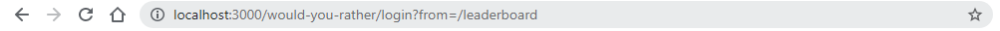
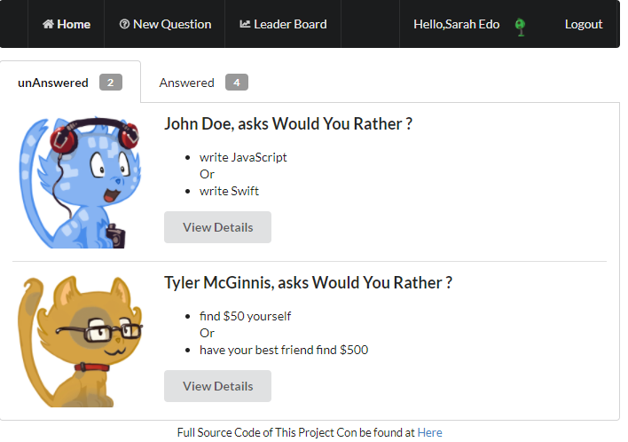
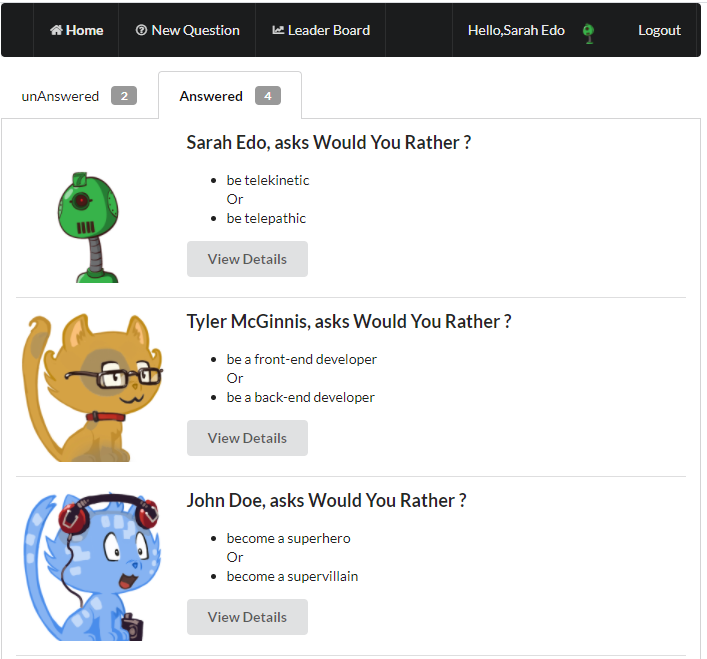
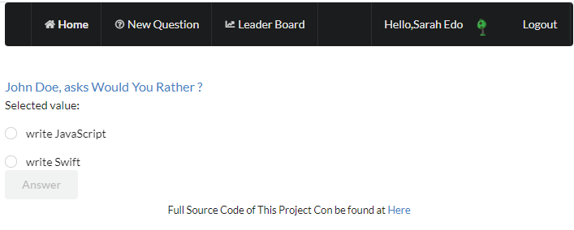
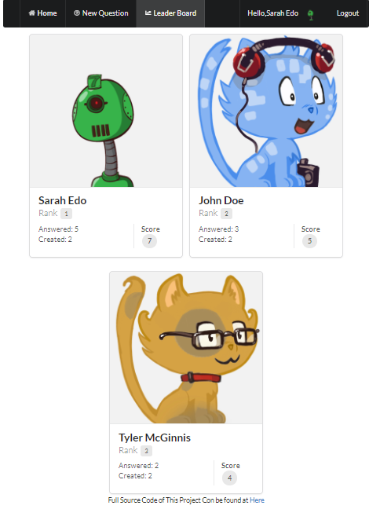

# Would Your Rather - React Redux app

The Would You Rather app has been created using React and Redux as part of the React NanoDegree requirement from Udacity. This is the 2nd of three required projects.

The app provides the user the ability to create questions with 2 possible answers. For example, "Would you rather, write JavaScript or write Swift"? The app also provide users to answer and view question results (polls) of other users. The app allows users to login (without password) as different users. The backend JSON data is provided by a static JavaScript file so new questions and polls don't actually get saved. However the app does mimic real world scenarios with a slight delayed save responses. The app provides a full example with clean code, how various React and Redux components and packages are combined to create a meaningful solution that may also be referenced in future projects.

## Video Walk Through

A video walk through is available here: including installation and app overview.

## Installation

1. You need to have Node.js, npm and yarn installed.
2. Proceed with cloning or downloading the project as a zip.
3. Extract and change directory to the project folder.
4. Run `yarn`
5. Then run `yarn start`
6. Your default browser should open at port 3000 with the address: http://localhost:3000
7. You should be connected to the Internet as the app accesses images (user avatars).

## Login

http://localhost:3000/login

There is a built-in list of three users to choose from. As it's a demo app there is no password required to login. Simply select a user and click login.

Users must login first before they can access any part of the app.

The login page remembers the page the user came from. So for example, if the user is visiting `leaderboard`, he will be redirected to login. Upon login success, user is redirected to the Leaderboard view.

## Home

The home page is composed of a list of questions asked by various users (including the current logged in user) in chronological order (newest first). The questions are categorized in to 2 tabs with a count of questions for each category:

When a user first visits the home page, the Unanswered Questions list are shown.

## Unanswered Questions (question count)

## Answered Questions (question count)

The only exception is when a new questions is created, the user is shown the Unanswered Questions because it contains the new question the user just created and will list it as top.

## View Polls

`https://ahmedalima.github.io/would-you-rather/questions/<question_id>`

or

`http://localhost:3000/questions/<question_id> `

The `view` polls page shows details of a question.

- If the question has already been answered it will show the poll results.
- If the question has not been answered, it will allow the user to pick an answer and submit.

Poll results or answers are not shown to users unless they submit their own answer.

### Poll Results

Poll results are shown in the form of a total vote count and percent of votes. The currently logged in user's vote (answer) is also marked in the results.

### Answer Question

If a question has not been answered by the user, then poll results are not shown and the user will need to submit an answer first. User cannot submit without choosing an answer (an error message gets shown).

## New Questions

http://localhost:3000/add

Users can submit new questions. Two possible text field options are shown and both needs to be filled. Since this is a Would You Rather app, possible answer options should be typed as individual statements. For example, a would you rather option one could be "Watch Breaking Bad" and option two "Watch Californication".

## Leaderboard

http://localhost:3000/leaderboard

The leaderboard page shows the rank of users sorted on their scores. Scores are calculated based on simple formula as a sum of total questions answered and total created questions.

## Logout

Upon clicking logout the user is logged out and the login page is shown.

## Redirects, Referrals and 404s

1. The login component remembers referred URLs. For example, a user may directly try to access the URL http://localhost:3000/leaderboard. The app will first redirect the user to http://localhost:3000/login so they can login first. Then the app will automatically redirect to the original referred URL http://localhost:3000/leaderboard.
2. If a non-existent URL is accessed the app will show a 404 error.
3. If a question is accessed that does not exist, the app will redirect the user to a 404 error page.

